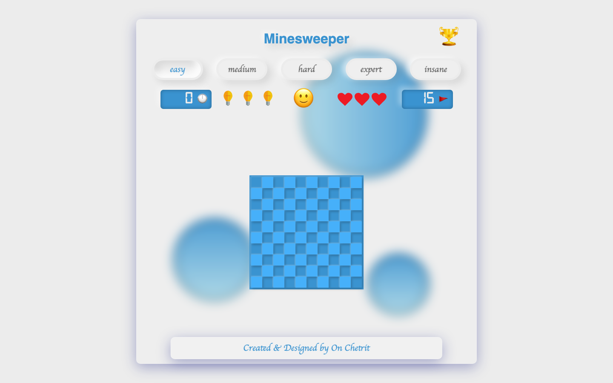
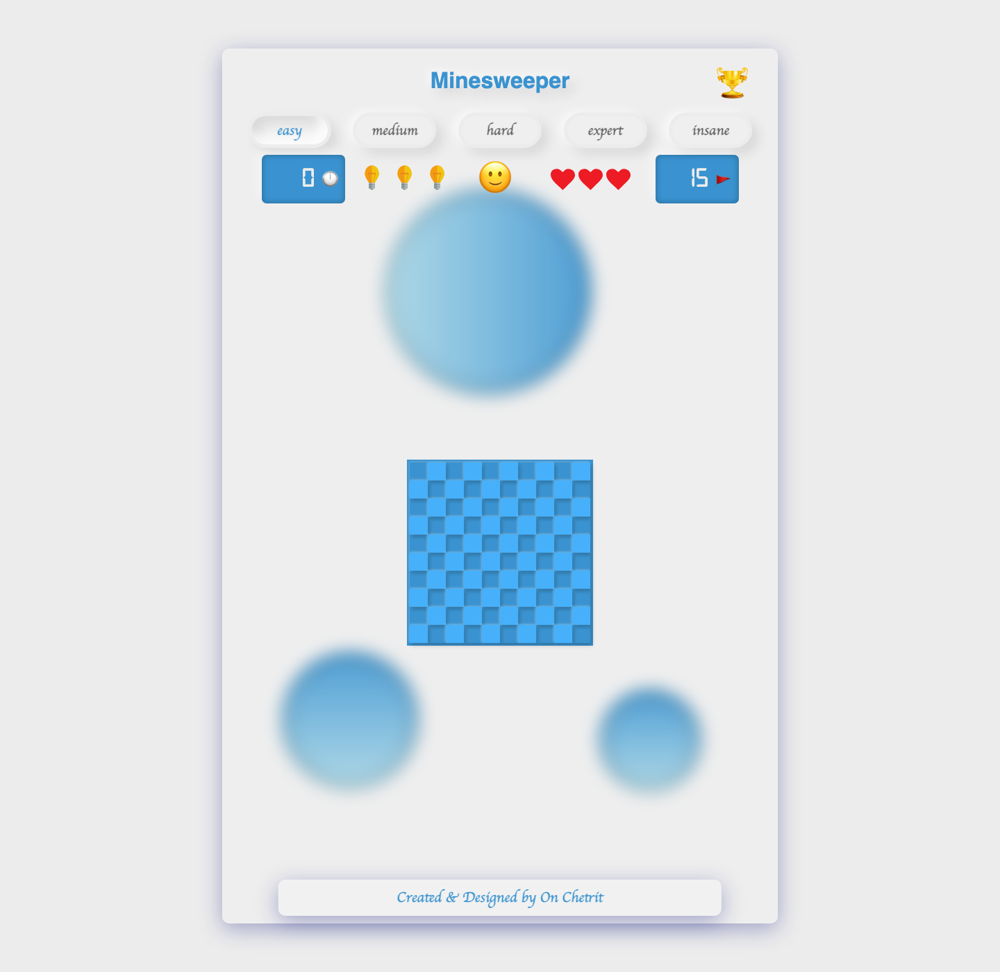
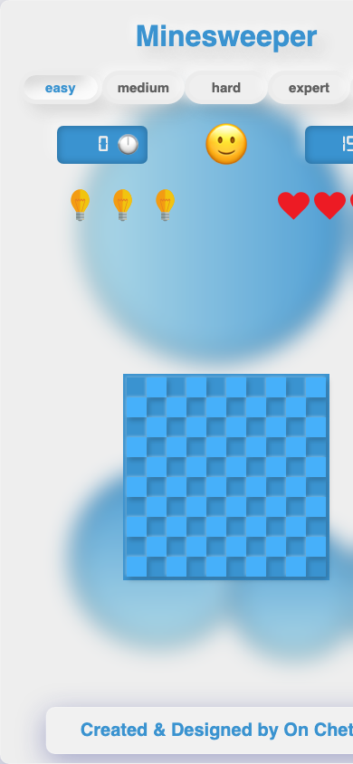

# Minesweeper

A classic Minesweeper game implemented with vanilla HTML, CSS, and modern JavaScript.

**Live site:** [onchetrit.github.io/minesweeper](https://onchetrit.github.io/minesweeper/)

## Highlights

- Interactive minesweeper board.
- Game-state and score handling in browser JavaScript.
- No framework or build step required.

## Screenshots

| Desktop | Game detail | Mobile |
| --- | --- | --- |
|  |  |  |

## Run locally

Serve the repository with any static HTTP server:

~~~bash
python3 -m http.server 8080
~~~

Then open http://localhost:8080.
